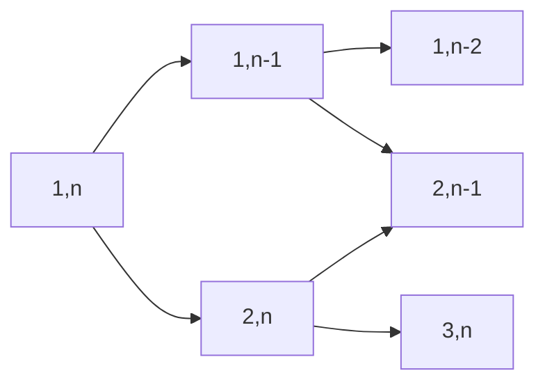

# CodeEveryday

每天在力扣上面的刷题记录，大概是每天三道题的样子，包括同专题的两道简单＋一道中等或困难，以后会逐渐增加难度的！前期刷题代码库当中可能还是会有参考样例吧，因为先是模仿然后再产出。

## 4/14 二叉树 1 & 双指针

今天是第一天，做了三道二叉树的题，好想一天做很多题，因为自己不会的东西真的太多了。积少成多，每天就算只做几道题做几个月也能将基本知识全部掌握。

### [P104 二叉树的最大深度](https://leetcode.com/problems/maximum-depth-of-binary-tree/)（简单）

一遍过，递归就好了。

### [P110 平衡二叉树](https://leetcode.com/problems/balanced-binary-tree/)（简单）

一遍过，注意自底而上比较快。

### [P124 二叉树的最长路径](https://leetcode.com/problems/binary-tree-maximum-path-sum/)（困难）

这道题做了好久，最后参考了题解，学会了怎么用 `MAXINT` 进行做题，类似的想法可以从求二叉树的最值元素当中引申出来。

本质是**自底而上**！在更新顶部的 `result` 的时候底部的 `result` 就已经被更新过了，所以全局变量 `result` 就完成了维持 `result` 的过程。

晚上没事做，又做了几道双指针的题。

### [P15 三数和](https://leetcode.com/problems/3sum/)（中等）

学会了双指针，一遍过，两个 90％。感觉是很神奇的方法，符合直觉并且真的是对的，本质上是一个二叉树的结构，有：

### [P16 最近的三数和](https://leetcode.com/problems/3sum-closest/)（中等）

一样的方法，不过需要变通一下，学一下题解看看怎么优化时间，用时有点长，不过内存还 ok。哦原来是有个判断放错地方了，多了一个 $O(n)$ 的判断时间，修改之后已经 96% 了，真不错。

### [P18 四数和](https://leetcode.com/problems/4sum/)（困难）

和三数和差不多，但是其实要简单一点。不过坑是真的多，自闭了有点。

（4/15 更新：其实用递归就行了，昨天头疼没想清楚，今天想明白了，对于任意的 $k$ 可以通过双指针 + 递归的方式实现 $O(n^{k-1})$ 的复杂度。那么可以做得更好吗？有空查阅相关信息）

## 4/15 树状数组 1

今天看到了这一个特殊的结构，打算把该专题下的 6 道题目全部做完，加油加油。（晚上更新，今天事情太多了，不过认真学会了，不过明天一定好好学！今天全是课 TAT，而且这个优美的结构比较难，得花点时间学。

### [P307 区域和检索 - 数组可修改](https://leetcode.com/problems/range-sum-query-mutable/)（中等）

我用前缀和做的，太慢了。然后认真学习了树状数组的知识。实际上就是树状数组的直接运用。

### [P493 逆序对](https://leetcode.com/problems/reverse-pairs/)（困难）

这道题之前做过，用递归可以做。用树状数组做逆序对也是一个很经典的方法，一步一步填进去，然后通过计算部分和进行比较就可以知道逆序对了。用树状数组也是一种方法，类似于应付普通的逆序对，往一个底层数组填进去 `2` 就行，然后读取部分和——也就是逆序对数了。不过这道题还有一些小技巧，离散化之类的。

## 4/16 学习 Golang 以及复习

今天复习期中去了，打算明天把树状数组剩下的几道题都做完。另外今天决定使用美国版的力扣了，中文网实在太卡……另外美国版使用 UTC 计时，就不会像今天这样过了零点了，比较符合作息时间。

## 4/17 树状数组 2& 正则表达式学习

今天认真学习正则表达式的语法，学习笔记放在了仓库根目录下面。今天逛了逛各大厂实习的招聘，越来越感觉自己要学的东西还有好多好多，就投了个小米的 Golang，所以等通知这些天还是要用 Golang 把题目刷好！今天认真学习的题就只有以下的：

### [P218 天际线](https://leetcode.com/problems/the-skyline-problem/)（困难）

这道题可以用希尔伯特形容费马大定理的一句话来形容——“会下金蛋的母鸡”，通过这一道题能够学会两种数据结构，分别是树状数组、线段树，还有扫描线算法。同时在其中也了解到了“离散化”的概念。下面简单对于这道题的不同做法做一个剖析：

#### 线段树

我们将横坐标离散化之后建立线段树，然后对于每个楼的横向区间进行 `Add()` 操作，建立这样的线段树之后再从左至右历遍这棵树的叶子节点（也就是底层线段）看每一段的 Value，也就是区间的最大值，就可以得出来所需要的 Skyline 了。

#### 扫描线算法

同样需要对横坐标进行离散化，之后考虑扫描线从左至右不断地前进，或者更通俗地说，我们可以想想一个人在 Skyline 上面奔跑的过程来理解，可以发现实际上我们这样一种前进的过程需要维护的就是我们脚底下的楼房集合，同时我们的 Skyline 就是这些楼房的最高点，也就是脚踩的地方。注意用来存储这个楼房最高点的数据结构应该同时很好地支持元素增减，所以最大堆不是很合适，我们使用二叉搜索树的结构就好了。

#### 树状数组

不像线段树，我们可以直接读取每一步当前小区间的 Value，所以没有办法向线段树一样走一步看一步（即每次都 `QuerySegTree(i,i+1)`）直接求出 Skyline，所以我们需要换一种思路。

虽然看起来树状数组的做法和线段树类似，但实际上完全不一样，树状数组的思路是：我们在从左至右的过程中逐步建树，这样遇到边界的时候，我们如何判断是否需要变化高度呢？关键就在于“一边建树一边从左至右”的顺序了，由于树状数组底层支持的是单点查询，如果我们用 `QueryBIT(i+1)` 表示查询***当前***（这一点非常重要！因为在建树的过程中会不断刷新树状数组，请记住这个修饰词）的 $\max[1,i]$，那么会发现根本没有办法判断是否应该变化高度！这是为什么呢？原因是此时你会发现 `QueryBIT(i+1)` 没有任何意义，因为他只能代表过去的最高楼，而不能给***当前***是否应该变化高度带来任何信息（可能有人会想到存在一个问题，我们需要录入楼房的信息，这实际上是需要我们区间修改；但是在维持最值的树状数组里区间修改并不需要使用差分数列的技巧，可以验证只需要对区间两个端点使用 `Add()` 方法即可（这非常神奇））即使我们可以完成维护，我们也会发现树状数组对这道题的作用和线段树的作用完全不一样。

那么我们应该怎么办呢？@halfrost 神之一手，把 `QueryBIT(i)` 的意义改成了 $\max[i,+\infty)$，这看起来并没有什么特别的，但是整个意义对于***当前***来讲非常重要，因为这个时候我们会发现，查询 `QueryBIT(i+1)` 的时候真正是关注此时此刻的信息，为什么？因为在之后的高楼根本还没有录入！

这一段解释我想了数个小时，@halfrost 本人可能能够知道自己的算法是怎么处理的，但是他在自己题解上的解释却让我更加困惑了，他说：

> 最大值既然难以“去除”，那么需要考虑如何让最大值“来的晚一点”。解决办法是将 `Query()` 操作含义从前缀含义改成后缀含义。`Query(i)` 查询区间是 $[1,i]$，现在查询区间变成 $[i,+\infty) $。例如：$[i,j]$ 区间内最值是 $\max [i,j]$，`Query(j+1)` 的结果不会包含 $\max[i,j]$ ，因为它查询的区间是 $[j+1,+\infty)$ 。这样更改以后，可以有效避免前驱高楼对后面楼的累积 `max()` 最值的影响。

将前一种方法的失效归因于“最大值难以去除”（这一点也算说的对），于是就要使用后一种方法来”让最大值来的晚一点”，这个解释就有些不知所云了，似乎指的是延迟更新树状数组的结构？但显然不是这样。“例如”后面的解释更加让人有点不明白了，因为在这道题当中不会涉及到 $\max[i,j]$ 这一个区间查询的操作，可能他只是想用这个例子来说明后面那句话：“这样更改以后，可以有效避免前驱高楼对后面楼的累积最值的影响”。是的，我们不想要累计信息，我们需要***当前***的信息，但是他的说法似乎在说要将“前驱高楼”和“后面楼的累计最值”，如果没有理解的人比如说前几个小时的我，就会把这里的“累计最值”仍然看成是前一种方法的 `QueryBIT()` 方法，但是这是自相矛盾的，因为这个累计最值本来就自然会包含前驱高楼的信息，所以才会让人很困惑。

说到底，这种困惑造成的原因是这些解释将问题矛盾归结于“前驱高楼”和“累计最值的矛盾”，但实际上矛盾的两个主体为“当前的点最值”和“累计最值的矛盾”：我们希望从累计信息当中得到点信息，但是没有相减操作的我们没法完成这样的信息推理，那么怎么办呢？让他们两个是同一个东西就好了。这才是这个问题使用树状数组的关键所在。

#### 总结

这道题非常值得深入地思考，特别是树状数组解题的相关部分。注意线段树不同于其他两种做法，它虽然看似在线生成一个 Skyline，但实际上还是离线生成一个线段树然后在这个树上求解出答案的离线算法，这一点可以从这两者的可分离性看出来，这也是树状数组做法和线段树做法让人感觉到相似但不同的原因所在（或者说，本质还是维护最值的树状数组没有办法进行小区间查询，它只有形如 $(x-\mathop{\text{lowbit}}(x)]$ 的信息）。

## 4/18 哈希表

今天考一门期中考没有考好，下午休息了一会重新调整好了，下半学期努力:face_with_head_bandage:！今天做哈希表相关的题目，并在做题的过程中体会这种数据结构的本质和使用方法。从今天开始我打算详细地写自己做题的过程，这样更有收获，不过花的时间更多，希望能够找到平衡点吧。（4/19）感觉自己写东西有些啰嗦，还是要简洁一点。

### [P3 最大无重复子序列](https://leetcode.com/problems/longest-substring-without-repeating-characters/)（中等）

#### 自己的解法：记录最后一次出现的指标

感觉很简单！我们用贪婪的算法，考虑一个“窗口” `s` 从左出发向右前进，遇到了 `s` 没有的元素 `'a'` 就 `append(s,'a')`，如果遇到了存在的元素 `'a'` 就将这个字节原来所在位置之前的全部减去，然后将新遇到的添加到 `s` 当中，然后我们再维护最大长度就行了。

那么问题就在用什么去动态存储 `s` 呢？需要满足以下几个方法：

- 能够完成删去 `s` 开头的一段的操作
- 能够获取 `s` 的长度
- 能够添加新元素
- 能够很快地查找一个元素

看到后两条似乎要用哈希表了（当然确实要用），但是前两个怎么处理呢？我们可以用抽象的办法去完成前两个操作，也就是不实际上存储 `s`，只用两个端点：

- 维护一个 `LeftIndex` 表示 `s` 此时的左端点，右端点不需要存储，这是由于 `s` 的右端点就是当前读取到的 `index` 减 1，这样我们就可以动态地获取 `s` 的长度了，当然你可以选择直接维护 `s` 的长度。
- 维护一个哈希表 `H[x]=LastIndex(x)`，这里的 `LastIndex(x)` 函数表示 `x` 最后一次出现的 `index`，那么每次我们读取到 `InputS[index]`，那么 `H[InputS[index]]` 就应当更新为 `index`。

但是这里有个问题，如果 `InputS[index]` 当中存储的位置已经不在 `s` 当中了，那么我们实际上不应该更新 `s` 的长度。当然这个非常好解决，我们只需要判断 `LeftIndex <= H[InputS[index]]` 是否成立就可以了，如果成立才更新。另外还有一个小问题，如果用 `H[x]` 存储的是 `index` 的原始值，在实际操作的时候，它会被初始化为 `0`，在循环中会被认为是对于任意的 `x`，它一开始都在字符串的第 `0` 位出现，这会导致我们的代码不简洁，此时我们只要将 `H[x]` 的意义加一就可以避免这种情况。

#### 题解：记录出现在窗口内的频率

关于判断字符是否出现在窗口内，题解使用了另外一种方法，也就是使用数组 `freq[x]` 记录元素在窗口内的次数，这种记录方式将“窗口”的存在感增加了，也就是**实际存储了窗口**，而我想的更加抽象一点；另外一方面，就本题而言，使用 `freq[]` 在移动左窗口的时候是一步一步移动的，会比我的做法慢一点。

### [P992 K 个不同字符的子字符串](https://leetcode.com/problems/subarrays-with-k-different-integers/)（困难）

这道题还是用上一道题类似的“窗口”想法，维护一个有 `k` 个不同值的窗口。注意这题要把计算答案和移动窗口分开，移动窗口要更加懒惰一些。有以下两种做法（这道题类似于上一题，用两种记录元素的方式都哦可以）：

#### 维护三个指针

这种做法就是窗口的自然推广，注意我们如果遇到了一个元素，我们就需要读取一个窗口中间的指针，这个指针指向第一个窗口移动到此处后一个位置就会使得窗口内元素类减 1 的位置 `Mid`（其实也可以不存，每次构造一个左指针的副本向右移动到元素内减一，但是这样的话会浪费很多时间），我们需要利用它去完成两个事情：

- 计算答案
- 移动左指针，维护窗口

那么我们的流程表就出来了，通过解耦和优化可以变得比较简洁。维护完指针之后我们就可以进行计算答案了，当且仅当现在窗口内有 `k` 种元素就让 `res+=Mid-Left+1` 即可。

#### 分解题目

这种做法本质上和上一种做法没有什么不同（想想为什么）：将题目答案考虑成两个问题的差，即最多出现 `k+1` 种和最多出现 `k` 种的子串个数之差，这样的话（对于单个）问题就不需要维护中间那个指针。

## 4/19 线段树

今天要准备复习离散数学了，可能做的题没有那么难，还要花时间学学 Golang 怎么写 web 应用。今天的知识点是线段树，主要目标是实操怎么写线段树。

### [P303 区域和检索 - 数组不可修改](https://leetcode.com/problems/range-sum-query-immutable/)（简单）

这道题是简单题，主要用来练习怎么写线段树，代码库中放的是前缀和的写法。似乎这道题的算排名和运气有关。

### [P699 掉落的正方形](https://leetcode.com/problems/falling-squares/)（困难）

这题真的和天际线好像啊，直接用维护最大值的线段树应该就行了。先离散化之后，之后每一步先查询区间然后再区间更新，注意维护全局最大值。

## 参考

- [题解参考以及选题参考](https://books.halfrost.com/leetcode) @halfrost
- [选题参考](https://github.com/greyireland/algorithm-pattern/) @greyireland
