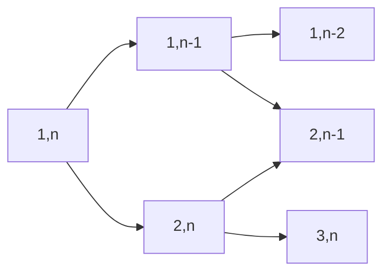

# CodeEveryday

每天在力扣上面的刷题记录，大概是每天三道题的样子，包括同专题的两道简单＋一道中等或困难，以后会逐渐增加难度的！前期刷题代码库当中可能还是会有参考样例吧，因为先是模仿然后再产出。

## 4/14 二叉树 1 & Two Pointers

今天是第一天，做了三道二叉树的题，好想一天做很多题，因为自己不会的东西真的太多了。积少成多，每天就算只做几道题做几个月也能将基本知识全部掌握。

### P104 二叉树的最大深度（简单）

一遍过，递归就好了。

### P110 平衡二叉树（简单）

一遍过，注意自底而上比较快。

### P124 二叉树的最长路径（困难）

这道题做了好久，最后参考了题解，学会了怎么用 `MAXINT` 进行做题，类似的想法可以从求二叉树的最值元素当中引申出来。

本质是**自底而上**！在更新顶部的 `result` 的时候底部的 `result` 就已经被更新过了，所以全局变量 `result` 就完成了维持 `result` 的过程。

晚上没事做，又做了几道双指针的题。

### P15 三数和（中等）

学会了双指针，一遍过，两个 90％。感觉是很神奇的方法，符合直觉并且真的是对的，本质上是一个二叉树的结构，有：

### P16 最近的三数和（中等）

一样的方法，不过需要变通一下，学一下题解看看怎么优化时间，用时有点长，不过内存还 🆗。哦原来是有个判断放错地方了，多了一个 $O(n)$ 的判断时间，修改之后已经 96% 了，真不错。

### P18 四数和

和三数和差不多，但是其实要简单一点。不过坑是真的多，自闭了有点。

（4/15 更新：其实用递归就行了，昨天头疼没想清楚，今天想明白了，对于任意的 $k$ 可以通过双指针 + 递归的方式实现 $O(n^{k-1})$ 的复杂度。那么可以做得更好吗？有空查阅相关信息）

## 4/15 树状数组

今天看到了这一个特殊的结构，打算把该专题下的 6 道题目全部做完，加油加油。（晚上更新，今天事情太多了，不过认真学会了，不过明天一定好好学！今天全是课 TAT，而且这个优美的结构比较难，得花点时间学。

### P307 区域和检索 - 数组可修改（中等）

我用前缀和做的，太慢了。然后认真学习了树状数组的知识。实际上就是树状数组的直接运用。

### P493 逆序对（中等）

这道题之前做过，用递归可以做。用树状数组做逆序对也是一个很经典的方法，一步一步填进去，然后通过计算部分和进行比较就可以知道逆序对了。用树状数组也是一种方法，类似于应付普通的逆序对，往一个底层数组填进去 `2` 就行，然后读取部分和——也就是逆序对数了。不过这道题还有一些小技巧，离散化之类的。

## 4/16 学习 Golang 以及复习

今天复习期中去了，打算明天把树状数组剩下的几道题都做完。另外今天决定使用美国版的力扣了，中文网实在太卡……另外美国版使用 UTC 计时，就不会像今天这样过了零点了，比较符合作息时间。

## 4/17 完成树状数组练习题 & 正则表达式学习

今天认真学习正则表达式的语法，学习笔记放在了仓库根目录下面。今天逛了逛各大厂实习的招聘，越来越感觉自己要学的东西还有好多好多，就投了个小米的 Golang，所以等通知这些天还是要用 Golang 把题目刷好！

## 参考

- [题解参考以及选题参考](https://books.halfrost.com/leetcode) @halfrost
- [选题参考](https://github.com/greyireland/algorithm-pattern/) @greyireland
